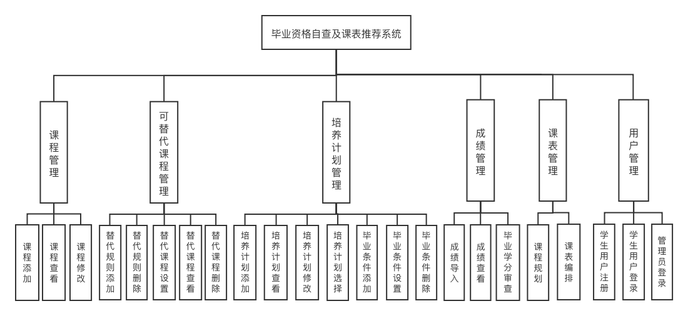
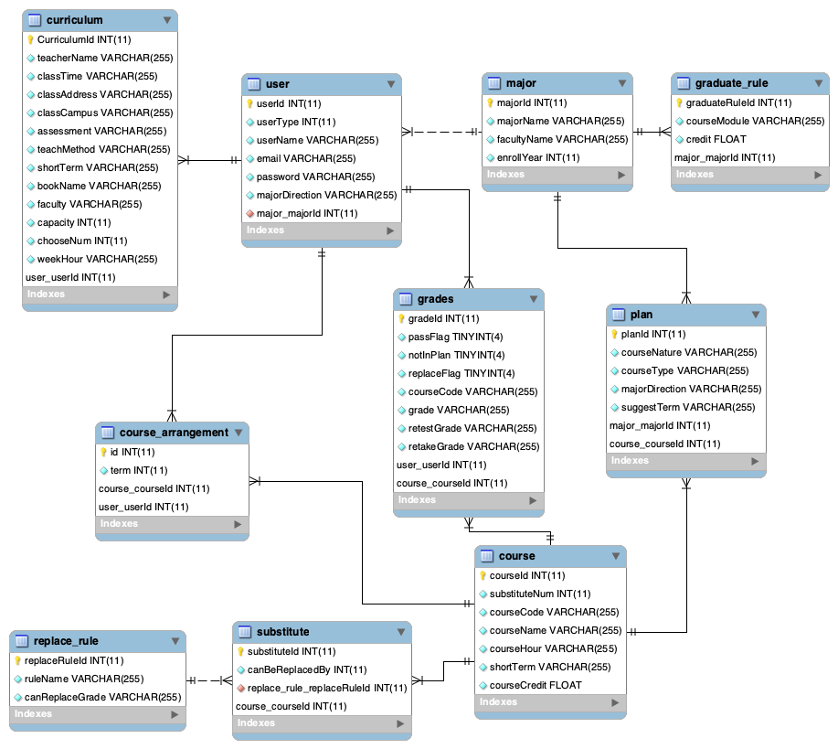
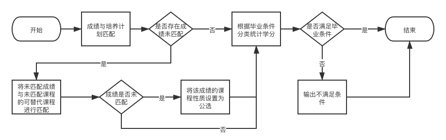
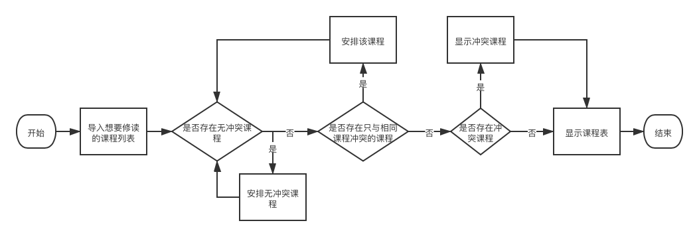
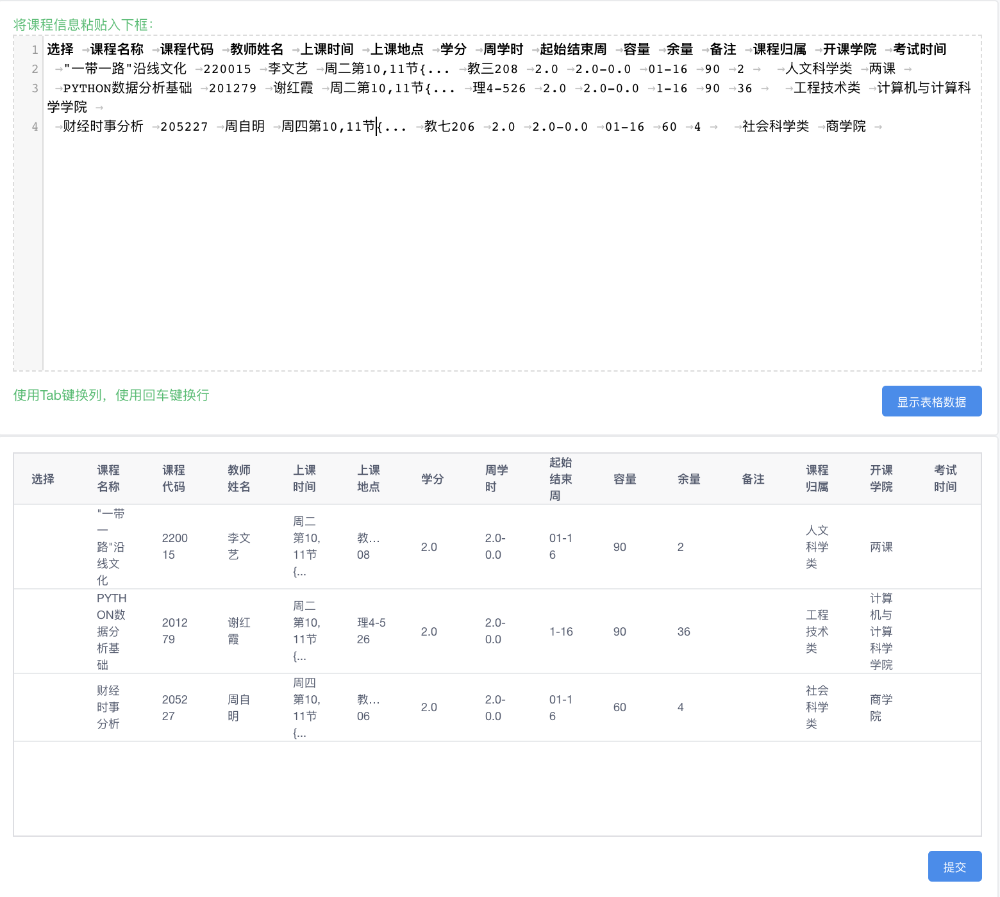
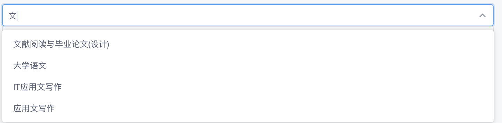
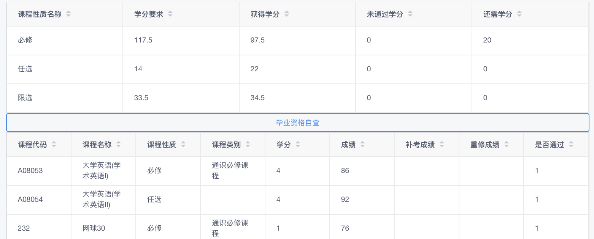
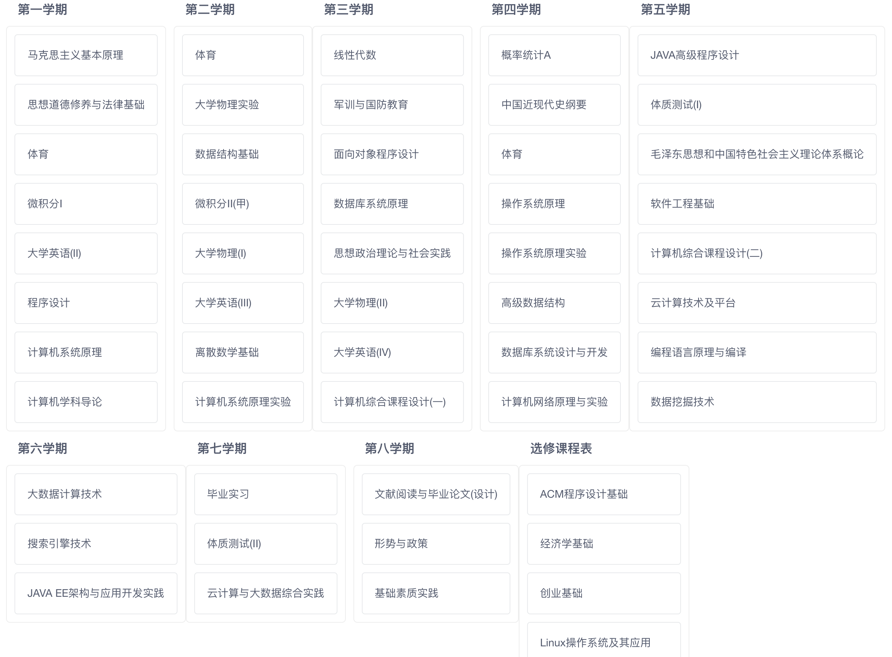
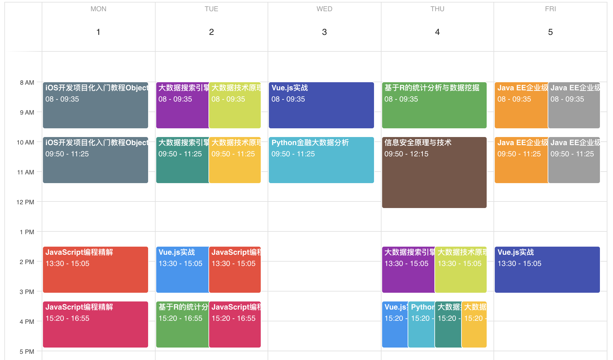
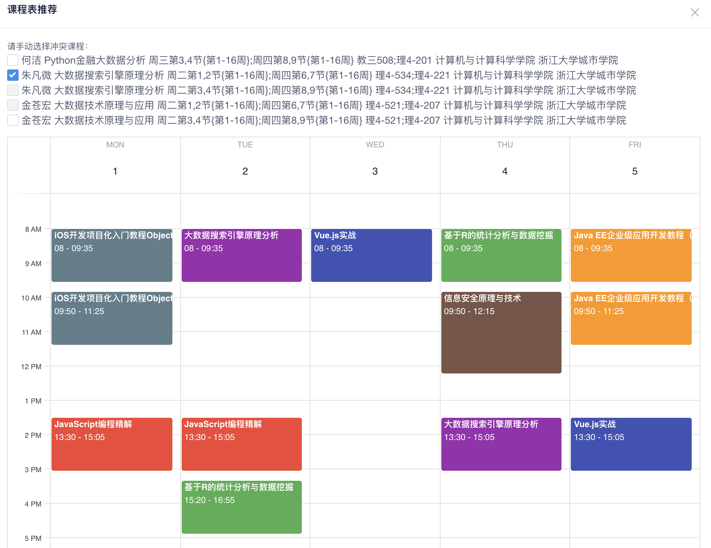

# 毕业学分自查及辅助选课系统

## 项目简介
解决教务管理软件无法正确分类统计学分的问题，为学生提供毕业学分自查、大学课程规划和课表编排功能。

前端：Vue框架和iview组件库

后端：[Malagu框架](https://github.com/alibaba/malagu)

数据库：MySQL

## 系统总体框架设计
系统使用角色分为学生和管理员。学生端主要有课表管理模块和成绩管理模块。管理员端主要有课程管理模块、培养计划管理模块和可替代课程管理模块。系统总体框架图如下

## 数据库设计
本系统存在课程实体、课程表实体、课程规划实体、成绩实体、毕业条件实体、专业实体、培养计划实体、替代规则实体、可替代课程实体和用户实体这十个实体。系统EER图如下

## 主要业务流程设计

### 毕业学分审查流程

### 课表编排推荐流程

## 系统界面展示

### 数据导入
使用paste-editor和Table组件，实现了采用粘贴表格数据的方式导入课程数据。
第一行默认是表头，使用回车键换行和Tab键换列。点击显示表格数据时会对每行粘贴数据的列数进行检查，看是否与第一行相同，对不相同的行进行提示。粘贴数据判断无误后，以表格的形式显示出来后即可点击提交保存到数据库。

### 搜索与修改
使用Select下拉搜索器组件实现对课程名或代码搜索的功能和slot插槽实现修改功能。

### 成绩查看界面
学生成绩中的课程性质等根据学生培养方案实时变化，使得学分分类统计准确。

### 大学课程规划界面
使用Draggable和Card组件实现了让学生以拖拽移动的方式对各学期想要修读的课程进行总体规划。

### 辅助选课界面
系统根据学生导入的所有想修读的课程信息自动检测可避免冲突的课程，将可避免冲突的课程以课表的形式展现，并罗列出冲突课程以供学生选择。手动选择课程后，会在课表中同步展现，并将与选择课程所冲突的课程设置为无法选择，提高选课效率。冲突课程的展示与选择功能使用了Checkbox多选框组件来实现

所有课程信息展示如下：

无冲突课程辅助选课界面如下：

## 未来工作
1、毕业资格自查部分仅局限于毕业学分部分的检查，需完善其他的毕业条件审核。
2、课表推荐功能比较简单，只向学生推荐了可避免冲突课程的编排方案，未实现个性化推荐。
3、本系统数据输入依靠人工粘贴导入，可实现对所需数据自动爬取。
4、可替代课程设置依靠人工设置，可尝试实现自动识别相似课程。
